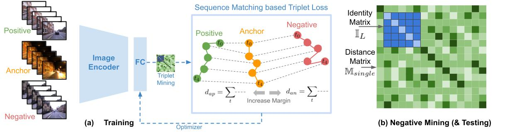

# mavNet

<p align="center">
  
    <br/><em>mavNet: Contrastive Learning with Sequence Matching.</em>
</p>

## Setup
First install Miniconda for your operating system. 
### Conda
After installing Miniconda, create a virtual environment.
```bash
conda create -n mavnet
```
Install Faiss GPU using conda
```bash
conda install -c conda-forge faiss-gpu
```
Install Pytorch for CUDA
```bash
pip install torch torchvision torchaudio --index-url https://download.pytorch.org/whl/cu118
```
Install remaining dependencies
```bash
pip install wandb tqdm tensorboardX scipy scikit-learn h5py termcolor
```

### Download
Download the dataset from this folder and put it in the ./data/descData/netvlad-pytorch/ folder.

For downloading the pretrained models use this link and put the downloaded folder in ./data/runs

## Run

### Train
To train mavNet on the Oxford dataset with sequence matching:
```python
python main.py --mode train --seqL 5 --pooling --dataset oxford-v1.0 --loss_trip_method meanOfPairs --neg_trip_method meanOfPairs --expName ox10_MoP_negMoP
```
For the Nordland dataset:
```python
python main.py --mode train --seqL 5 --pooling --dataset nordland-sw --loss_trip_method meanOfPairs --neg_trip_method meanOfPairs --expName nord-sw_MoP_negMoP
```

To train without sequence matching (Basically seqNet):
```python
python main.py --mode train --seqL 5 --pooling --dataset oxford-v1.0 --loss_trip_method centerOnly --neg_trip_method centerOnly --expName ox10_CO_negCO
```

### Test
```python
python main.py --mode test --seqL 5 --pooling --dataset oxford-v1.0 --split test --resume ./data/runs/<name_of_the_model_file>
```

## Acknowledgement
The code in this repository is based on [oravus/seqNet](https://github.com/oravus/seqNet) and [Nanne/pytorch-NetVlad](https://github.com/Nanne/pytorch-NetVlad).

#### Other Related Projects
[SeqNet](https://github.com/oravus/seqNet);
[Delta Descriptors (2020)](https://github.com/oravus/DeltaDescriptors);
[Patch-NetVLAD (2021)](https://github.com/QVPR/Patch-NetVLAD);
[CoarseHash (2020)](https://github.com/oravus/CoarseHash);
[seq2single (2019)](https://github.com/oravus/seq2single);
[LoST (2018)](https://github.com/oravus/lostX)

